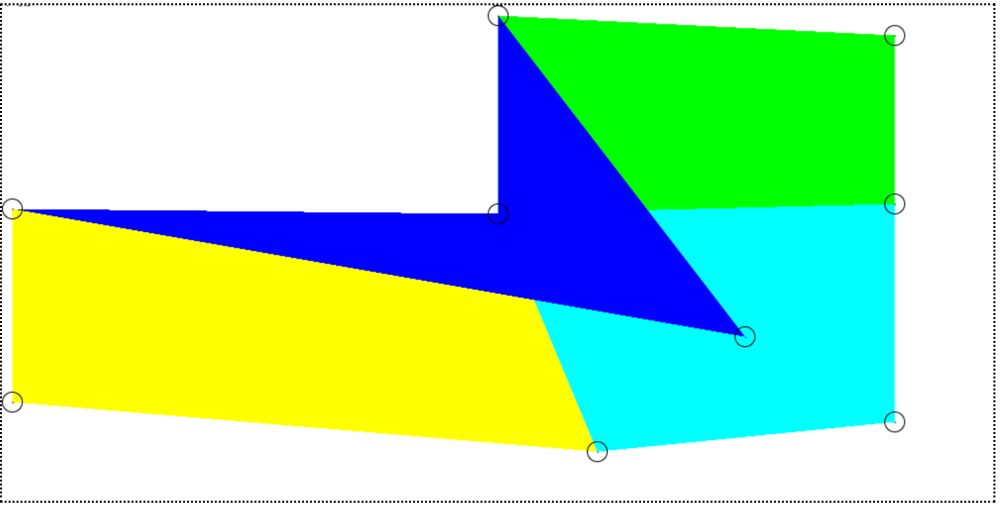
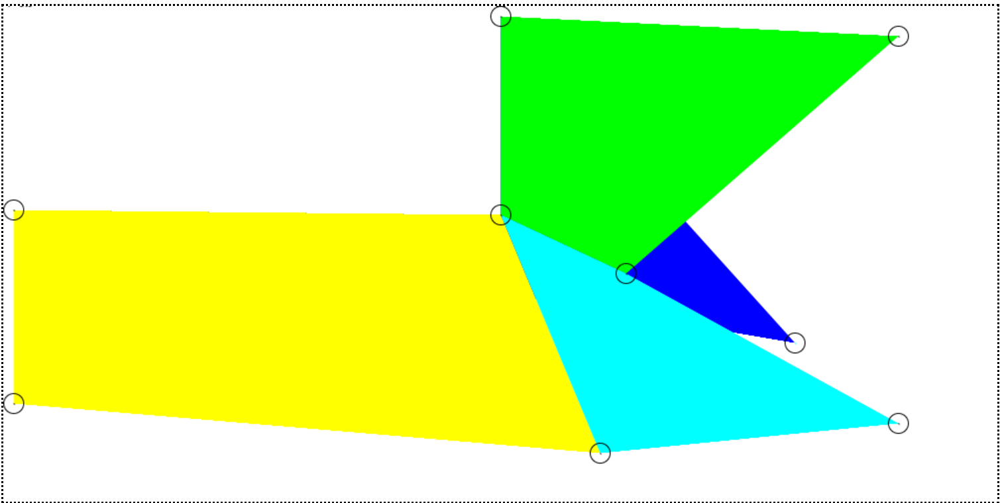
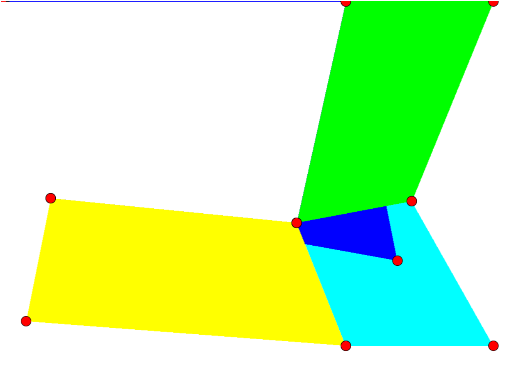

[TOC]
# Project1 四边形网格交互式编辑
## 基本信息
- SOFT130062.01 计算机图形学
- 2020级软件工程 郭仲天 19307110250
---

## 项目目录
```bash
├── CG_Project1.pdf  # 项目要求
├── config.js        # 四边形配置文件
├── readme.md        # 项目文档
├── scan_conservation.css   # 项目样式文件
├── scan_conservation.html  # 项目主页
└── scan_conservation.js    # canvas的扫描转化的PJ逻辑
```
---

## 开发与运行环境
### 开发环境
- Windows 10
- Visual Studio Code
- Chrome 110.0.5481.180
### 运行环境
- Chrome 110.0.5481.180
### 如何运行
> 直接进入文件夹后双击`scan_conservation.html`即可运行
---

## 项目的亮点
### 架构清晰
- 项目按照前端的html、css、js分配,将逻辑和样式分离,因此我们可以清晰的在js中查看逻辑,在css中查看样式
- 在js中,对各个功能进行了函数封装,使得代码更加清晰,如:
```js
//绘制一个点
function drawPoint(cxt, x, y, color){}
//绘制一条线段
function drawLine(cxt, x1, y1, x2, y2, color){}
//绘制一个圈
function drawCircle(cxt, x, y, r){}
//绘制canvas
function drawCanvas(cxt,vertex_pos,vertex_radius,vertex_color,change_vertex){}
//鼠标按下并移动事件
function mouseDownAndMove(dom, callback) {}
//扫描线填充算法
function scanLineFill(vertexes,vertex_color){}
//判断是否在圆内
function isInCircle(x,y,vertex_pos,vertex_radius){}
//初始化画布
function initCanvas(canvas,maxX,maxY){}
//重绘画布
function refreshCanvas(cxt){}
```
- 这使得html中几乎没有逻辑,只有调用js中的函数,因此html更加简洁
```html
<script>
    let canvas = document.getElementById("scan_conversion_canvas");
    let cxt = initCanvas(canvas,canvas_size.maxX,canvas_size.maxY);
    cxt.translate(0.5, 0.5);
    mouseDownAndMove(canvas,function(e){
        updateVertexPos(index,e.offsetX,e.offsetY);
        refreshCanvas(cxt);
    });
    drawCanvas(cxt,vertex_pos,vertex_radius,vertex_color);
</script>
```

### 函数式编程
- 在js中,尽可能的将函数抽象为pure function,使得函数的输入和输出是确定的,不会产生副作用,这样可以使得函数更加可靠,更加容易测试

### 实现监听函数
- 在html中,没有监听鼠标按下并移动的事件函数,因此我自己实现了一个监听的工具函数如下:
```js
//鼠标按下并移动事件
function mouseDownAndMove(dom, callback) {
    let flag = false;
    let fn = function (e) {
        callback(e);
    };
    // 添加鼠标按下监听
    dom.addEventListener("mousedown", function (even) {
        // 当鼠标按下时, 添加鼠标移动监听
        flag = true;
        index = isInCircle(even.offsetX,even.offsetY,vertex_pos,vertex_radius);
        if(index!=-1){
            dom.addEventListener("mousemove", fn);
        }
    })
    // 添加鼠标弹起监听 , 即鼠标不在按下
    dom.addEventListener("mouseup", function () {
        dom.removeEventListener("mousemove", fn);
    })
    // 当鼠标在其他元素中弹起时的操作, 规避鼠标弹起后 dom 无法捕获的异常
    document.addEventListener("mouseup", function () {
        flag = false;
        dom.removeEventListener("mousemove", fn);
    });
}
```

### 扫描转换算法的实现
实现代码如下:
```js
//扫描线填充算法
function scanLineFill(vertexes,vertex_color){
    //扫描线填充算法
    //1.找出最大y和最小y
    let maxY = 0;
    let minY = canvas_size.maxY;
    for(let i=0;i<vertexes.length;i++){
        if(vertexes[i][1]>maxY){
            maxY = vertexes[i][1];
        }
        if(vertexes[i][1]<minY){
            minY = vertexes[i][1];
        }
    }
    //2.扫描线从最小y到最大y
    for(let y=minY;y<=maxY;y++){
        //3.找出所有与扫描线相交的边
        let intersectEdges = [];
        for(let i=0;i<vertexes.length;i++){
            let j = (i+1)%vertexes.length;
            if(vertexes[i][1] == vertexes[j][1]){
                continue;
            }
            if(vertexes[i][1] < vertexes[j][1]){
                if(y >= vertexes[i][1] && y < vertexes[j][1]){
                    intersectEdges.push([i,j]);
                }
            }
            if(vertexes[i][1] > vertexes[j][1]){
                if(y >= vertexes[j][1] && y < vertexes[i][1]){
                    intersectEdges.push([i,j]);
                }
            }
        }
        //如果相交边的数量为偶数,则填充
        if(intersectEdges.length%2==0){
            //4.找出所有与扫描线相交的边的交点
            let intersectPoints = [];
            for(let i=0;i<intersectEdges.length;i++){
                let edge = intersectEdges[i];
                let x = vertexes[edge[0]][0] + (y-vertexes[edge[0]][1])*(vertexes[edge[1]][0]-vertexes[edge[0]][0])/(vertexes[edge[1]][1]-vertexes[edge[0]][1]);
                intersectPoints.push(x);
            }
            //5.对交点排序
            intersectPoints.sort(function(a,b){
                return a-b;
            })
            //6.填充
            for(let i=0;i<intersectPoints.length;i+=2){
                let x1 = intersectPoints[i];
                let x2 = intersectPoints[i+1];
                drawLine(cxt,x1,y,x2,y,vertex_color);
            }
        }
        
    }
}
```
---

## 开发中遇到的问题
### 绘制顶点难看见
> 问题描述

当时绘制顶点时,直接调用了`drawPoint`的函数,但是由于它只绘制一个点,因此在屏幕上几乎无法显示,导致我误以为函数的绘制并没有成功,花费了大量时间去调试没有bug的代码
> 问题解决

通过修改`drawPoint`函数的绘制代码,改为绘制一条线段后,在canvas画布上就可以清晰的展现出来绘图的结果了,于是便可以开始后面的代码执行

### 鼠标拖动顶点更新顶点位置
> 问题描述

当时错误的认为,当检测到鼠标位置在圆圈内时,便可以更新顶点的位置,写出了错误的代码,造成了鼠标一旦移动过快便无法跟随渲染的bug,错误代码如下:
```js
function isInCircle(x,y,vertex_pos,vertex_radius){
    for(let i=0;i<vertex_pos.length;i++){
        let dis = Math.sqrt(Math.pow(x-vertex_pos[i][0],2)+Math.pow(y-vertex_pos[i][1],2));
        if(dis<vertex_radius){
            vertex_pos[i][0] = x;
            vertex_pos[i][1] = y;
        }
    }
```

> 问题解决

将更新顶点位置的任务写在`mouseDownAndMove`函数中,从而实现持久跟随鼠标移动渲染的能力
```js
//鼠标按下并移动事件
function mouseDownAndMove(dom, callback) {
    let flag = false;
    let fn = function (e) {
        callback(e);
    };
    // 添加鼠标按下监听
    dom.addEventListener("mousedown", function (even) {
        // 当鼠标按下时, 添加鼠标移动监听
        flag = true;
        index = isInCircle(even.offsetX,even.offsetY,vertex_pos,vertex_radius);
        if(index!=-1){
            dom.addEventListener("mousemove", fn);
        }
    })
    //...
}
//判断是否在圆内
function isInCircle(x,y,vertex_pos,vertex_radius){
    for(let i=0;i<vertex_pos.length;i++){
        let dis = Math.sqrt(Math.pow(x-vertex_pos[i][0],2)+Math.pow(y-vertex_pos[i][1],2));
        if(dis<vertex_radius){
            return i;
        }
    }
    return -1;
}
```

## 项目的思考(可能的缺陷)

### 渲染先后问题

> 我们在本次PJ中渲染的实际上是四个多边形,换言之,他们之间由于顶点的移动会出现**重合**的部分,从而会因为canvas渲染的先后导致遮盖的问题



- 我这里采用的策略是判断**被移动顶点所在的四边形**,然后首先渲染**非被移动顶点所在的四边形**,再渲染**被移动顶点所在的四边形**,从而达到最好的视觉效果,而这也与助教在Sample给出的是一致的
- 然而这依然会存在问题,例如,如果移动顶点造成了两个以上的四边形变化,在我的实现中会最后绘制这两个四边形,如下图我会**最后绘制绿色和蓝色的四边形**:


- 但是助教给出的Sample中此处并没有把蓝色部分最后渲染,造成了一定的差异,但是我个人认为这只是canvas绘制时的先后顺序选择问题,对于本次lab的功能实现和算法设计并没有直接关系,因此我认为**此处的问题并不重要**



### 鼠标监听时间的采样率
> 由于在canvas上监听鼠标移动有一定的采样频率,因此一旦鼠标移动过快且离开canvas,那么会造成顶点移动的跟手性问题

目前这个问题出现的原因在于html元素的监听事件的采样频率,因此目前还没有较好的解决方法,包括助教给出的Sample中也存在相同的问题
